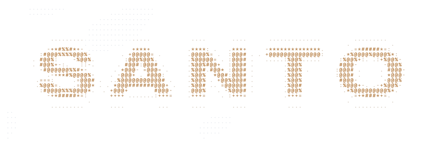

<picture>
  <source media="(prefers-color-scheme: dark)" srcset="assets/header-dark.png">
  <source media="(prefers-color-scheme: light)" srcset="assets/header-light.png">
  
</picture>

### Most of what I build implements the hard part instead of importing it.

A pulse detector that does its own bandpass filtering and FFT instead of leaning on a DSP crate. Tokenizers trained, then measured against a benchmark I published so the numbers are checkable by someone who doesn't trust me. Retrieval indexes, agent runtimes, voice pipelines.

Two threads run through most of it. **Bengali NLP**, because the tooling everyone else takes for granted still handles the script badly. And **tools I actually run**, because the ones I use every day are the ones that get finished.

<sub>


</sub>

---

## Kotha-1 &nbsp;·&nbsp; [bengali-tokenizer-eval](https://github.com/oneKn8/bengali-tokenizer-eval)

**Tokenizer choice changes what Bengali costs you by 5 to 9x. Here is the measurement, the data, and the cause.**

<p align="center">
  
</p>

Thirteen SentencePiece tokenizers trained and evaluated against nine public ones across a 3,000-document Bengali corpus. The worst failures trace back to a single character: leave U+09BC (Bengali Nukta) out of normalization and byte-fallback climbs from roughly 2% to 20%, accounting for 89.8% of every byte-level token produced.

All thirteen tokenizers ship in the repo, with the benchmark set, a per-document SHA-256 manifest, a datasheet, the frozen evaluation results, and the paper. The table is meant to be rerun, not taken on faith.

<sub>Python · SentencePiece · ACL-format paper</sub>

---

## [undertone](https://github.com/oneKn8/undertone)

**Push-to-talk voice typing for Linux. Hold a key, speak, release, and the words land in whatever window has focus.**

[](https://pypi.org/project/undertone/)
[](https://github.com/oneKn8/undertone)
[](https://github.com/oneKn8/undertone/blob/main/LICENSE)

Groq Whisper with a local faster-whisper fallback, cleanup that is guarded against quietly rewriting your slang into corporate English, and clipboard-plus-evdev injection for the apps that refuse synthetic keystrokes. Runs as a systemd user service.

```
pipx install undertone
```

I dictate with it daily, which is why the rough edges keep getting filed down.

<sub>Python · PyPI · systemd</sub>

---

## [granum](https://github.com/oneKn8/granum)

**Insurance denial appeals, optimized the way an immune system optimizes antibodies.**

Populations of appeal strategies mutate, compete on an LLM judge's score, then promote or apoptose. The loop is a real germinal center: negative selection, tournament, elitist retention, feedback-directed mutation. Strategy lineage is tracked through Arize Phoenix over MCP.

The web demo replays frozen artifacts from real runs rather than calling the model live, and the code says so plainly instead of passing it off as live inference.

<sub>Python · Gemini on Vertex · Phoenix MCP</sub>

---

## [glyphlab](https://github.com/oneKn8/glyphlab)

**Turn any image into character art in the browser. Nothing is uploaded.**

<p align="center">
  <a href="https://glyphlab-rose.vercel.app">
    
  </a>
</p>

ASCII, Braille, halftone, sextants, and contour tracing, plus export to selectable text, ANSI, animated GIF, and playable terminal movies. It also emits buildable LEGO and cross-stitch charts using real BrickLink part numbers and DMC floss codes.

**[Try it](https://glyphlab-rose.vercel.app)** &nbsp;·&nbsp; the header above this page was rendered with the same density ramp.

<sub>TypeScript · Canvas · client-side only</sub>

---

## Also worth your time

| Project | What it is | Built with |
|---------|------------|-----------|
| **[Research-Agent](https://github.com/oneKn8/Research-Agent)** | Research pipeline as a LangGraph state machine, with LaTeX and BibTeX output hardened against shell-escape injection | Python, LangGraph |
| **[profgraph](https://github.com/oneKn8/profgraph)** | Professor intelligence for any LLM: ratings, a teaching-style classifier, and real UT Dallas grade distributions | Python, MCP |
| **[vitals](https://github.com/oneKn8/vitals)** | See your own pulse on a webcam. Eulerian video magnification and FFT-based rPPG, with the filter math in the source rather than a dependency | Rust, rustfft |
| **[soniq](https://github.com/oneKn8/soniq)** | AI phone agent for small businesses. LiveKit voice pipeline, tenant isolation enforced by Postgres row-level security rather than a WHERE clause | TypeScript, Python |
| **[lifeagent](https://github.com/oneKn8/lifeagent)** | Accountability bot that checks what you claim against GitHub, Strava, and Wakatime before it believes you | TypeScript, Postgres |
| **[agentgov](https://github.com/oneKn8/agentgov)** | Policy engine gating agent trust and release. Signed, idempotent decisions with homoglyph-aware prompt-injection scanning | TypeScript, MCP |
| **[drift](https://github.com/oneKn8/drift)** | Audio post-production for generated music, with its own beat-synced chroma loop detection and Camelot-wheel arrangement | Python, React |
| **[machine-memory](https://github.com/oneKn8/machine-memory)** | Local-first file and repo search daemon, exposed to agents over MCP | TypeScript, SQLite |

---

<p align="center">
  
</p>

<p align="center">
  <a href="https://x.com/shifat_santo"></a>
  <a href="https://www.linkedin.com/in/shifatislam-santo/"></a>
  <a href="mailto:shifatislamsanto764@gmail.com"></a>
  <a href="https://discord.com/users/onekn8"></a>
</p>
